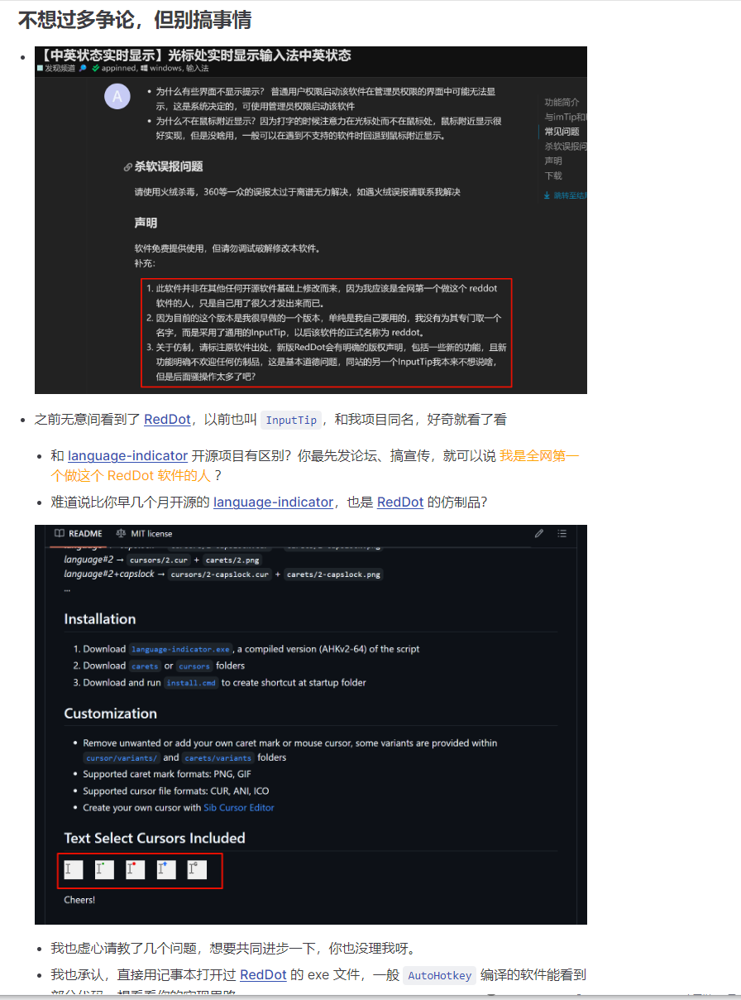
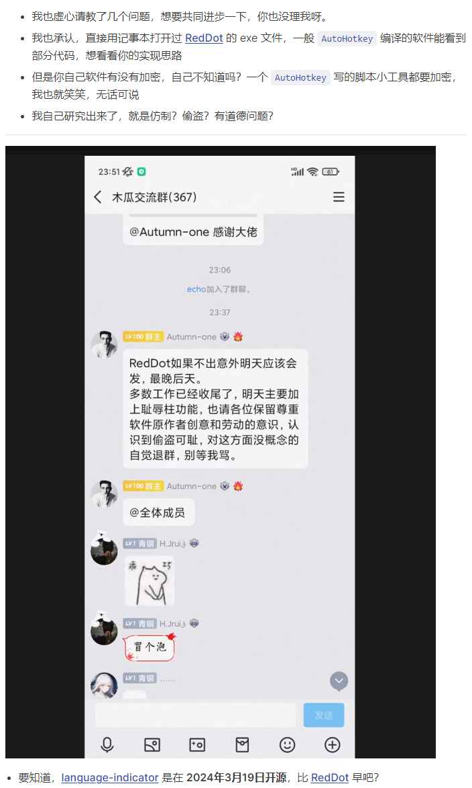
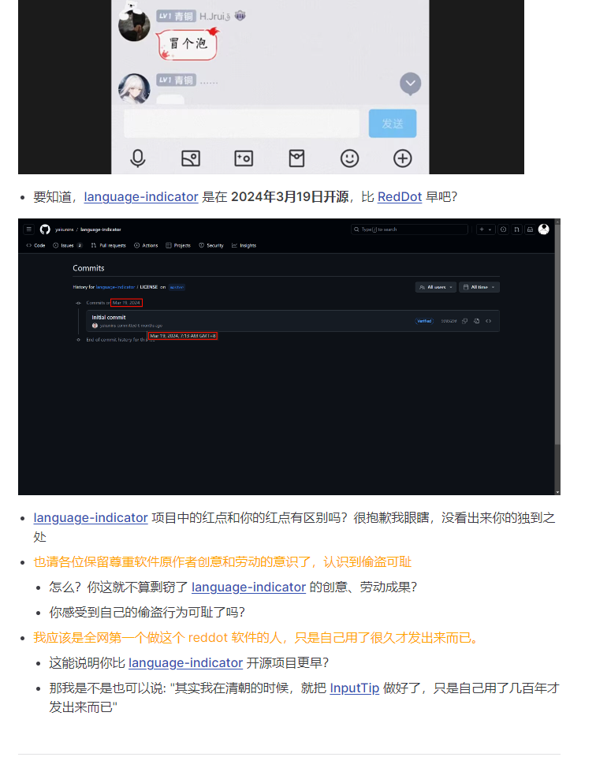

# 抄袭RedDot功能的软件列表

## InputTip

### 起因

**2024年9月4日**我在某论坛发布了标题为《【中英状态实时显示】光标处实时显示输入法中英状态》的帖子，帖子中发布了《中英文实时提示InputTip@dev0.2.exe》 程序，没两天这篇帖子得到了不错的流量反馈（重点），很多人需要这类软件，当时软件提供的功能主要是在光标处显示一个圆点，红色圆点表示输入法为中文，绿色圆点表示输入法为英文。这里声明一点虽然是9月4日发到论坛，但实际上我应该是全网第一个开发这类软件的（指在光标附近以色块提示中英文状态功能），在更早的时候我还做过2个用鼠标来提示中英文状态，但是由于鼠标提示太鸡肋所以我没有推广，但是时间都远早于下面这那位。

发布的同日我被用户建议添加大写锁定状态，后面抽了空在9月10日之前将大写功能添加了进去，并与9月10日回复了提出该需求的用户并附上了实现后的结果GIF。

9月10日当天，一个 abgox 的账号在我帖子下方询问部分功能的实现方式。

**2024年9月10日**名为 abgox 的账号，发布了标题为《InputTip: 一个输入法状态(中文/英文/大写锁定)提示工具。》的帖子，内容是一个叫做InputTip的软件，其提供了与我发布软件同样的功能，只是我的中英文提示是圆点色块，他的事方块色块。

在此之前他的InputTip只具备根据鼠标样式判断中英文状态，光标处提示是他在 **2024年9月9日** 开始编写的功能，如下是他软件的提交日期，看起来很可笑，在此之前是2024年3月份有代码改动，在我发布软件之后立马像是找到了人生方向一样不要命更新，很急真的非常急，以至于可以看一下他当时做的软件界面有多仓促：

下面是最开始他做的软件界面：

我知道你很急，但真的有这么急？

然后某论坛的帖子出现了如下的奇葩场景：

其实到这里我只是感觉有点恶心，但是没打算追究啥，如果只是抄一个光标的色块提示并且他的形状还只是正方形也就算了，懒得去较真，主要我看有人提出让其也制作成圆形提示，我看他拒绝了，所以还算是有差异化。

ok，我以为到这里就结束了，抄一点儿就抄一点儿把，您看看下面（注意日期）

是不是黑人问号？挣扎了这么几天还是受不了？算了抄吧？放开了？

然后来看看我们的图片目录：

下面是我的软件，注意这是最开始的版本，9月10日之前有一个中间版本还有一个叫做 `capslock.png` 的图片

下面是是这位抄袭者的：

**怎么样？离不离谱？**

到这里我就觉得很无法理喻了，肆无忌惮？还心安理得？

于是我在忍无可忍的情况下才写下了如下的声明：

我其实为物种的多样性感到奇怪，综上到底是什么勇气让你在自己的帖子下写下了如下一段话？

**搞事情？** 贼喊捉贼事儿是天天都有啊，你要不再把**搞事情**这三个字念100遍？重新审视和体会一下？

**最后在次说一下似乎你现在唯一能抓到的救命稻草就是说我是抄 language-indicator的，因为此所以你抄我的那就不算错，是这个逻辑吗？**

很遗憾，我在做RedDot之前压根不知道 **language-indicator** 这个项目，并且我尝试这个功能的时间点在你提到的那个项目之前，并且就算再不济，我仍然有最后的手段就是公开早期代码，所以这条路走不通，而且基于上面的逻辑和证据还压根用不到我所说的最后的手段。其实你自己能不知道我并没有基于**language-indicator** ？你知道！因为逻辑上来说如果我基于那个软件那么我做的早期版本就不会缺少大小写功能！

然后还有一个奇葩逻辑，我没开源你照着功能做一套就不算抄袭？

https://inputtip.pages.dev/declare/

其实你知不知道如果你如果一开始问过我或者不问但是在软件中明确提及参照我的软件那么都会没事，但是你说先抄了并公开发，然后在跑来说友好问我？你友好在哪里？你有很多办法避免这个情况，却选择默默抄袭，然后在我说抄袭之后搞一个漏洞百出的小丑文章。

**最后我问几个问题**

1. 你有没有抄RedDot的软件功能？（其实不需要你回答，证据已经强调的不能再强调了）
2. 你怎么厚着脸皮试图通过说我抄别人，然后合理化你抄我的？（这个其实也不需要你回答）
3. RedDot后续的新功能还要不要抄啊？该不会后续的新功能也是我从别人哪里抄过来的吧？没事给你抄，我怎么控制得了全天下小偷的手呢？
4. 你一个野路子还试图贬低我的技术么？我加密你解不开是你的问题，你没发现我说的那并不是一个强壳么？我加密是因为我对开源不感冒，这一点都想拿来当救命稻草？你省省吧，我是本人就是某个技术团队的leader，职业就是编程，ahk只是业务写点儿小东西而已，想碰瓷技术还是别来碰瓷了。致辞没啥要说的了。

有判断能力的自然能判断，并且我觉得上面证据完全足够应对后续的这位小偷的其他小聪明，为了搞这档子烂事儿浪费的时间真是廉价！

