# 抄袭RedDot功能的软件列表

## InputTip抄袭全过程

### 事件整体简述（完整详情往下看完即可）

2024年9月4日我在某论坛发布了RedDot软件，9月10日被人抄袭以极其类似的标题发布了同类软件，但最开始只抄袭了一个功能点且看到抄袭者明确表示后续不会继续抄袭对应功能所以我未予以追究，并且当天抄袭者在我帖子下面询问我部分功能如何实现，这在抄袭者看来是礼貌询问，然后我没理他，我认为他完全重新定义了什么叫礼貌和虚心，先抄了发出来，然后在跑来问，你这是偷了我小鸡之后在跑过来跟我打招呼？我能回你什么？更何况你可不是过来打招呼的，你是偷了我小鸡然后跑来问我家大公鸡在哪儿，离谱不？9月22日左右我发现了该软件一改之前的口吻继续抄袭了我软件的其他功能只是变个颜色而已（并且现在仍在继续抄袭），于是我认为此时已经构成严重抄袭行为，并且实际上在此期间有部分人用的是抄袭者的软件结果跑到我的群里提Bug，并且有人对着两篇帖子已经傻傻分不清的，还跑我帖子下面提抄袭者软件的bug，这是抄袭者想要的效果？所以在忍无可忍的情况下我修改了论坛帖子的声明部分（但还是很克制），如下：

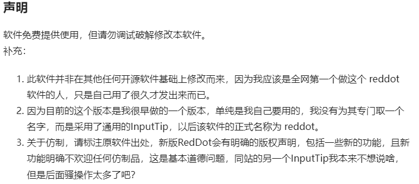

后来抄袭者在帖子发布了如下的漏洞百出和逻辑混乱的文章：链接如下：https://inputtip.pages.dev/declare/

看到这篇文章的第一时间我感受到的是纳闷儿，贼喊捉贼见过，但没见过这么明目张胆的，所以我花了一些时间来整理了一下问题所在，下方的详细过程有我对这篇奇葩文章的所有回应。

我想证明或知道的有以下几点，所有的行为都围绕着这几点进行：

1. 抄袭者的软件是否抄袭了我的软件功能？（注意我从来没说过抄的是我的源码，我压根没开放源码是所有人知道的事情，不要此地无银，东拽西扯）
2. 你软件中相当多的实现线索和设计是否来自于我的帖子？
3. RedDot 后续的更新还抄不抄？

接下来是详细的时间线与证据截图，其实即便没有这些只要是论坛关注过这两篇帖子的都应该心知肚明，我这里整理一下只是为了方便其他人了解事件始末。

### 起因

**2024年9月4日**我在某论坛发布了标题为《【中英状态实时显示】光标处实时显示输入法中英状态》的帖子，帖子中发布了《中英文实时提示InputTip@dev0.2.exe》 程序，没两天这篇帖子得到了不错的流量反馈（重点），很多人需要这类软件，当时软件提供的功能主要是在光标处显示一个圆点，红色圆点表示输入法为中文，绿色圆点表示输入法为英文。这里声明一点虽然是9月4日发到论坛，但软件编写时间早于这个时间点，我自己用了很久期间发到了一些群里，发现并没有那么多的受众，所以很佛系，压根没想过靠这个增加曝光度，所以这个软件早期叫：`中英文实时提示InputTip`，`InputTip`翻译过来是：“输入提示” 这是一个极其通用的名称，**在抄袭者发布帖子之后我意识到过于通用名字的问题，所以我更名为RedDot，也为了避免有人老是找错软件。**

在更早的时候我还做过2个用鼠标来提示中英文状态，但是自己用了很长一端时间发现鼠标提示太鸡肋所以我没有推广，后面自己都不用了（而且我写的软件远不止这一个，除了系统实用工具还有我职业相关的作品，被抄也不是第一次，对于这种小的功能一般我都懒得专门取名字。放出一小部分作品出去是想着万一有与我相同需求的人想用刚好可以帮到别人），但是时间都远早于抄袭那位，下面是我随便在我网盘找的软件源码文件打包的截图，注意打包时间是我写完之后并用了很久然后才打包作为存档的时间，这是我写的第二个鼠标提示中英文状态软件，第一个更早一些由于是demo级别的也就丢失源码了。（我运行了InputTip最早期的可用的代码，效果与我更早发在某些群里或我视屏里展示出来的鼠标状态提示效果是一样的，当然这个我不做太多过度解读，也有可能是巧合）

**（有一个很可笑的事实，后面抄袭者在那个漏洞百出的文章中刻意强调了自己的仓库是在2023年5月12日创建的，其实直到2024年9月8日他的那个仓库还就只有短短的数行代码，并且实现的功能只有改变鼠标样式，这位抄袭者可能连git能看到所有的更改信息都不知道，还是赌我不知道？）**

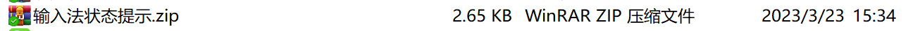

**在我软件发布的同日我被用户建议添加大写锁定状态，后面抽了空在9月10日之前将大写功能添加了进去，并于9月10日回复了提出该需求的用户并附上了实现后的结果GIF。**

9月10日当天，一个 **abgox** 的账号在我帖子下方询问部分功能的实现方式。

**2024年9月10日**名为 **abgox** 的账号，发布了标题为《InputTip: 一个输入法状态(中文/英文/大写锁定)提示工具。》的帖子，内容是一个叫做InputTip的软件，其提供了与我发布软件同样的功能，只是我的中英文提示是圆点色块，他的是方块色块。

**在此之前抄袭者的InputTip只具备根据鼠标样式判断中英文状态，光标处提示是他在 2024年9月9日 开始编写的功能。为什么是9月9号？为什么是9月9号？为什么是9月9号？**，如下是他软件的提交日期，看起来很可笑，在此之前是2024年3月份有代码改动，在我发布软件之后立马像是在偷盗中找到了人生方向一样不要命更新，很急真的非常急，以至于可以看一下他当时做的软件界面有多仓促：

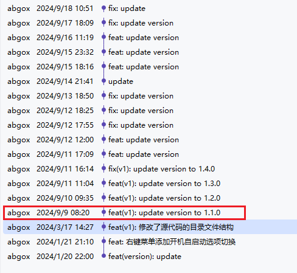

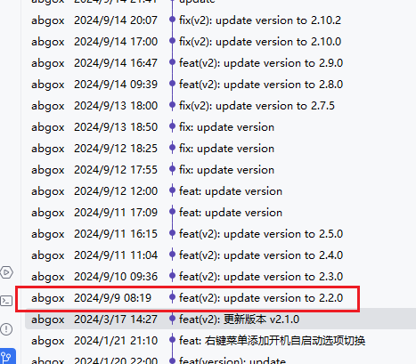

下面是最开始他做的软件界面：

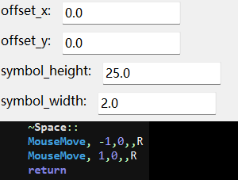

**我知道你很急，但真的有这么急？**因为看到在这个论坛有那么多人对这类软件感兴趣？

然后论坛的帖子出现了如下的奇葩场景：

其实到这里我只是感觉有点恶心，但是没打算追究啥，如果只是抄一个光标的色块提示并且他的形状还只是正方形也就算了，懒得去较真，主要我看**有人提出让抄袭者也制作成圆形提示，我看他拒绝了，所以还算是有差异化。**

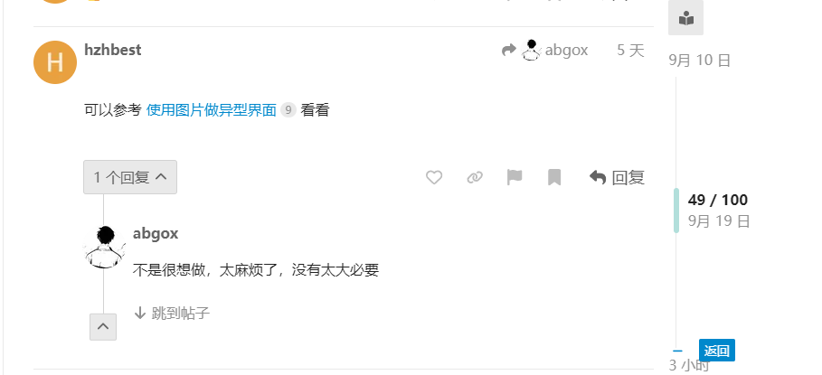

**ok，我以为到这里就结束了，抄一点儿就抄一点儿把，您看看下面（注意日期）**

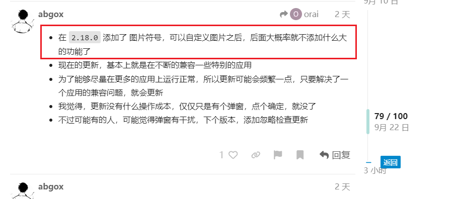

是不是黑人问号？**挣扎了这么几天还是受不了？算了抄吧？放开了？**

然后来看看我们的图片目录：

下面是我的软件，注意这是最开始的版本，9月10日之前有一个中间版本还有一个叫做 `capslock.png` 的图片

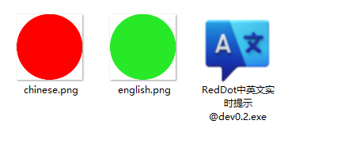

下面是是这位抄袭者的：

**怎么样？离不离谱？**

到这里我就觉得很无法理喻了，肆无忌惮？还心安理得？

于是**我在忍无可忍的情况下才写下了如下的声明：**

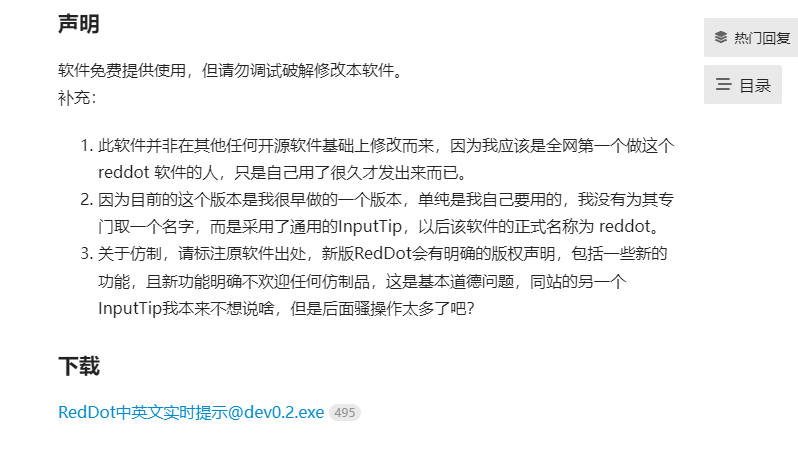

我其实为物种的多样性感到奇怪，**综上到底是什么勇气让你在自己的帖子下写下了如下一段话？**

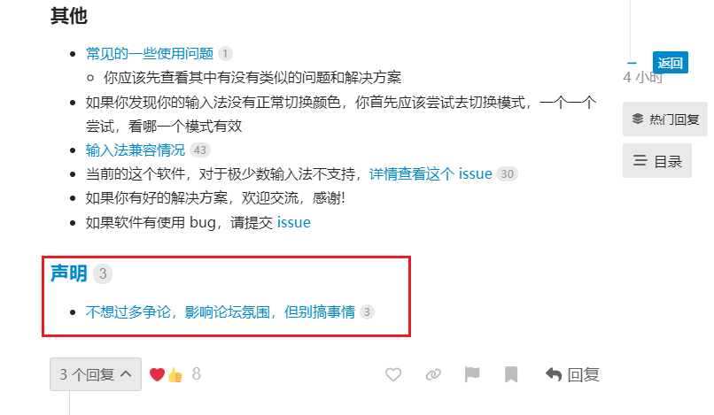

**搞事情？** 贼喊捉贼的事儿是天天都有啊，你要不再把**搞事情**这三个字念100遍？重新审视和体会一下？

### 接下来是对你那篇漏洞百出，逻辑混乱的文章的一一回应

下面将以截图的方式一一回应

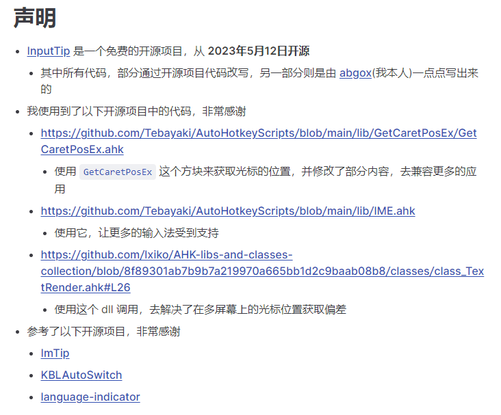

这是抄袭者文章开始的声明部分，**乍一看就很假**（等下再说为什么假）。

第一个问题是，你强调你的仓库创建时间，但是在9月9日之前你的仓库只有很短的几行代码实现的是鼠标状态提示而非光标状态提示，**光标状态提示的功能是我9月4日发布之后，你从9月9日开始写的！**

再来说为什么假惺惺，第一点是**你知不知道你列举的几个仓库的开源协议是MIT？**简单来说MIT就是我有一个东西我放到公共区域其他人也能用，并且其他人想用的时候不用告诉我，拿去干啥事儿都无所谓（由于是虚拟物品所以任何人拿去用了也不会少什么东西），你也不用跟别人说你拿的是我放在公共区域的东西，但是如果用出问题我也没有义务帮你解决，这就是MIT协议。看出问题所在了吗？就是你用MIT协议的代码不用写出来你用的谁的，毕竟很多大的项目依赖很多开源软件真完全写出来会非常多，但是，这里有个但是，如果你出于个人的感情或者你的良好习惯更或者对作者的其他感谢之心等你也可以这么多，事实上是有一部分人这么做，但是该抄袭者一定不是这样的人，这就是我说很假的原因！

**注意我要证明的是你抄了我的软件功能，这事儿一旦成立，那么你上面对MIT软件的声明就变得极其假惺惺！或者即便你死不认账但是大家都心知肚明，效果一样。**

**你抄了我一个不开源的软件功能你不写出处，然后我开始说你抄袭了，你跑去把所有MIT协议软件的写上来？这不假谁假？**

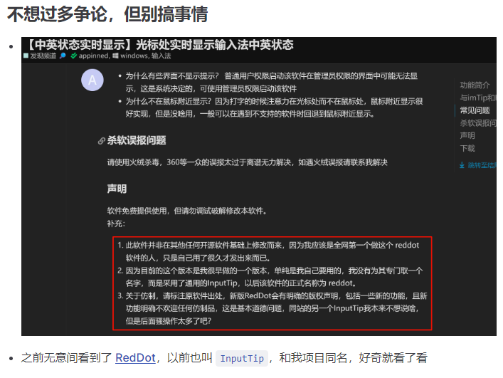

谁在搞事情？这是个问题。

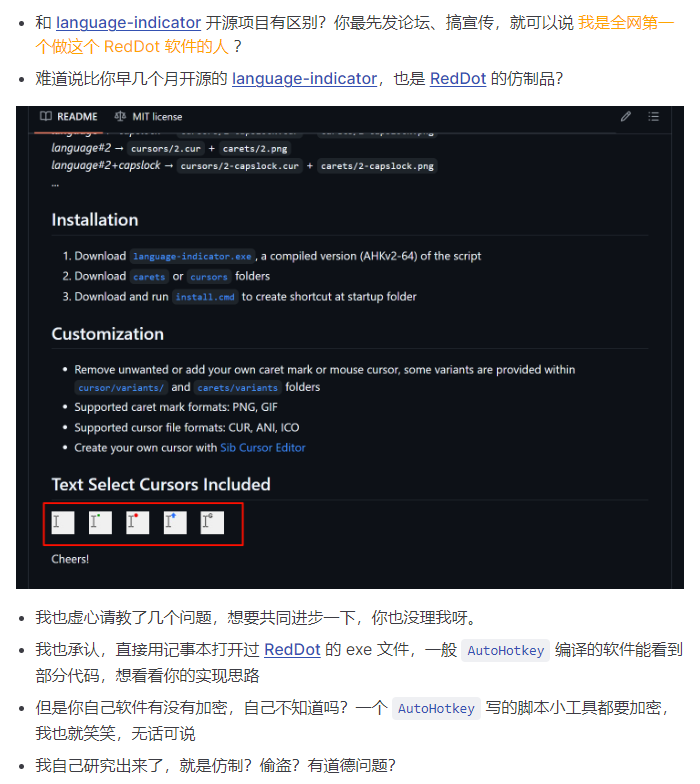

这部分是为了转移问题而刻意的抹黑，当然**只要你敢倒反天罡说我是抄的language-indicator, 我就一定能证明你在说假话**抹黑我，抹黑我这件事算另一笔账。

先说一个基本逻辑，我想说的是你抄袭了我的软件功能，然后你说我抄袭了**language-indicator**，实际上只要我说你抄袭我是事实，那么你说我抄袭 **language-indicator** 也证明不了自己什么，更何况事实是你在说假话，你可能也没想到我一定有办法证明你在说谎，诬陷六子吃粉那点儿小把戏在这里没用，我会拿出证据，但在证据足以说明情况让大多数人心知肚明得情况下即便你死鸭子嘴硬不承认我也会收手，因为这就够了，不到需要的时候我无需拿出更多，而且其实以你的逻辑水平和思维能力完全不需要我拿出更多的证据。

所以先回到我说你抄袭我软件功能这件事，另一笔账等下在算，暂时跳过。

**你说你虚心请教我几个问题，真够虚心的，先抄了发出来恶心我在跑过来虚心请教？你如果觉得我软件的功能好用可以先模仿，然后跑过来征得我同意然后再发。或者你懒得征得我的同意，你写上出处，我也不会说啥。再或者，最不济就是你隔两三个月再发我也懒得说（因为之前的作品有这样的，两三个月之后被抄了，我就发了几句牢骚然后就没管了）而你干的啥？况且，就算你已经抄了，最开始我并没有追究，是后来你是有啥抄啥，我忍无可忍了才在帖子修改了声明，你可能说我在群里说你仿制了，最开始那些用了你软件的人跑到我群里提bug，我要说这是另一个`原创`软件的问题么？**

"你用记事本打开过RedDot的文件" ？

你也承认尝试破译我的软件？你承认了不就得了么，说那么多掩盖什么？这里我想提醒你，我最开始就已经明确说了：“软件免费提供使用，但请勿调试破解修改本软件。”（注意这里调试、破解、修改是并列关系。）

后面你又来了一个：“但是你自己软件有没有加密，自己不知道吗？”

软件做初步防破解是我所有发布软件的明确特点，这个我有明说，你是看不见禁止调试破解吗？加密是为了防谁你不知道吗？不就为了防你这样的盗窃者么？

你说“一个ahk写的小工具都要加密，我也就笑笑，不说话”？

这句话我只听到了你对ahk的轻蔑，对ahk你是端起碗喊爹放下碗骂娘（这里你可以狡辩你想表达的情绪，让观众们自己理解）。ahk写的小工具加密有问题吗？我的软件我没有决定权你来决定？还是你是想碰瓷贬低我的技术？碰瓷技术我觉得你下辈子在尝试吧。对了这里你可以去开个辩论，题目我都给你想好了“软件加密不开源是混蛋”。

其实上面两句话与主题没那么相关，既然说到了这里我简单说一下我自己好了，我本身就是做软件出身的，从毕业第一份工作到现在8年开发经验，从上家公司到现在都是团队的前端leader岗位，ahk是我业余爱好之一，但是ahk其实是我技能的一部分，你说一个ahk都要加密是以为我只会这个？只是有些功能用这个写更合适我就会用这个写。由于ahk官方社区还挺特别，活跃度尚可，并且是一群兴趣使然的人（与我类似），也比较乐于助人，**我也受到过帮助，并且RedDot本身的部分功能就包含社区成员的帮助**，所以我自己也用业余时间为ahk社区做了一些事情：第一件事是，ahk社区的标准库实际上是完全跟不上现代语言标准库的节奏的，所以我编写了一个符合现代语言标准库特性的ahk标准库并且是开源的（并且刚好为ahk社区挽回了一部分觉得ahk写起来不够现代和方便的人），另一件事是ahk缺少类似npm那样成熟现代的包管理器，所以我开发了apm希望能够给ahk社区展示一个现代包管理器应有的最简化模样，只是希望能有帮助。

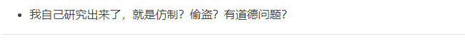

你自己研究出来了？你研究出啥了？你这还叫研究？你从我帖子拿到了多少信息有B数吗？照着功能复刻，代码是自己写的就不算抄了？还要我强调一下你抄了我的软件功能么？东扯西揶惯了。

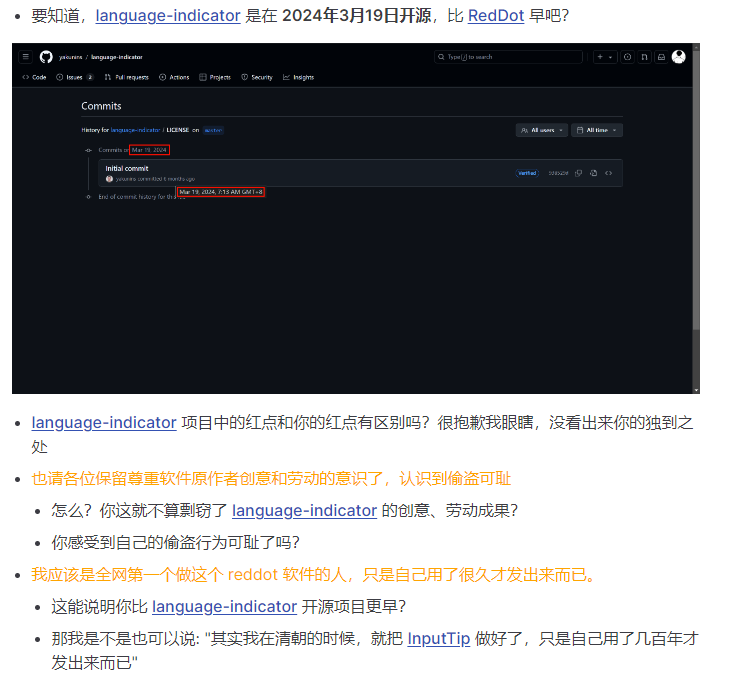

这里依然先跳过你抹黑的部分，说主题，

你确实挺瞎的，第一个问题，你能先跑一下 `language-indicator` 在跑来显眼么？这个软件的光标处提示是方块形状，你截的图是类似KBL的方案，是在在鼠标的指针图片旁边加了圆点，你自己截的图上面的标题就很明确了 "Text Select Cursors Included" 你自己找个软件翻译一下吧，真是臭鱼烂虾，这张冠李戴的说法你是故意的还是不小心的？还是故意不小心的？

下面是language-indicator 的图片（来跟我读：方块儿）

根据上面的说法我应该可以理解说你是参照了 "language-indicator" 而不是我的RedDot？

我是9月七号因为以下评论才知道这个项目：

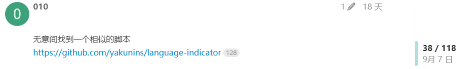

并且我有个习惯，有意思的项目会fork一下（fork方便查找），时间也是那两天

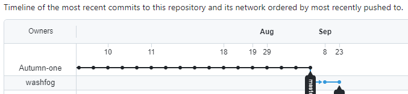

**你说你参照的是这个项目，那么你是什么时候知道language-indicator的？如果你在我发RedDot之前知道的，那为什么偏偏9月9号才开始编写光标处提示的软件功能（并且从开发光标提示功能开始才饿狼式更新你的抄袭软件），如果你在我发布RedDot之后才知道的language-indicator，那你为什么刚好会在我发布之后的5天这个节点并且在同样的论坛发布同样的帖子？如果你是在同一个论坛上才知道language-indicator软件的，那么你怎么做到不查看我的帖子来找到language-indicator软件的？如果你通过我的帖子来知道这个软件那你又是怎么做到先看到language-indicator 在看到RedDot的？如果你参照这个软件以你的调性，你一定会使用这个仓库的代码，你用了吗？在哪里？贴出代码和时间。到这里还要狡辩一下么?**

我看你从开发光标提示功能开始那叫一个急啊，急到一开始界面写成那个鬼样子，哦对了我知道了，你肯定是在看到我软件的前一秒钟先感应到了language-indicator的存在。

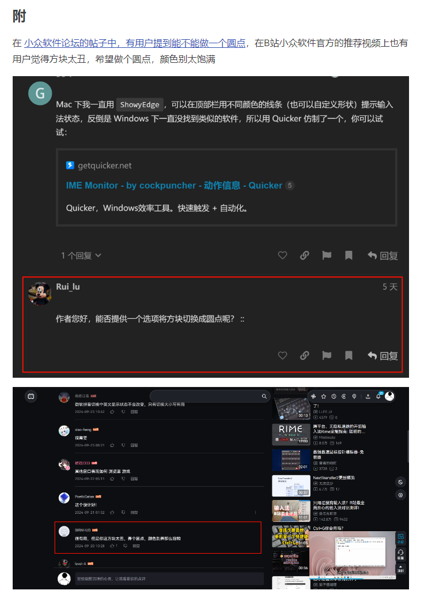

**你也知道抄圆点图片已经没法解释了所以结尾来一个用户要求啊？你这不也会承认么？所以呢？有这个烂理由作为法宝那你就可以天下文章一大抄了是吧？谁说你抄，你就来一个：用户要求，我建议啊，你还可以加强一下演技，就说你本人不知道自己抄袭的那个软件有这个功能。**

你又何必在一开始考虑到这样抄袭太明显了从而拒绝用户，然后又放弃内心的抵抗呢？

## 另一笔账：我抄language-indicator？

第一点： 参照我上面的fork日期，我是因为那个评论才知道这个项目。

第二点： 一个逻辑问题，如果我抄language-indicator，为什么一开始的工具缺少大小写功能？鼠标样式修改功能？为什么我写的哪哪儿都不像language-indicator？

language-indicator 添加大写图片的时间是2024年6月8日，怎么我用它代码还非要把这个不影响我使用的大小写功能砍掉？

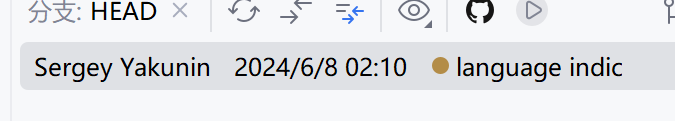

第三点： language-indicator 是MIT协议开源软件，假设我根据他改或者参照他部分代码（实际上新版本的大写图形是参照的），并且我自己不开源，这是符合规则且被允许的，那我为啥要单独说我之前不知道这个软件给自己埋一个坑？这种脑残没逻辑的事情抄袭者能做出来我相信，但我没有丝毫必要。

**最后在次说一下似乎你现在唯一能抓到的救命稻草就是说我是抄 language-indicator的，因为此所以你抄我的那就不算错，是这个逻辑吗？**

很遗憾，我在做RedDot之前压根不知道 **language-indicator** 这个项目，并且我尝试这个功能的时间点在你提到的那个项目之前，并且就算再不济，我退上七八十来万步我都能明确证明你在说谎，所以这条路走不通，而且基于上面的逻辑和证据还压根用不到其他的额外证据。其实你自己能不知道我并没有基于**language-indicator** ？你知道的嘛，不得不那么说啦。

**最后回到主题**

1. **你有没有抄RedDot的软件功能？（其实已经不需要你回答了，证据已经够充足，正如我上面说的如果大家都心知肚明即便你死鸭子嘴硬，我也会收手）**
2. **你怎么厚着脸皮试图通过说我抄别人，然后合理化你抄我的？（这个其实也不需要你回答）**
3. **RedDot后续的新功能还要不要抄啊？该不会后续的新功能也是我从别人哪里抄过来的吧？没事给你抄，我怎么控制得了全天下小偷的手呢？**
4. **你不但抄袭我还抹黑我这事儿怎么算？**
5. **你一个野路子还试图贬低我的技术么？（我并没有贬低所有野路子学习路线的人，我懂得学习过程中的不易，但是我贬低那些只会抄袭的野路子）我加密你解不开是你的问题，你没发现那并不是一个强壳么？你真私自解开看一下不说出来我也不知道也不会说啥，结果解不开还在那篇滑稽文章抱怨？**

我说你抄了我的，并且我给出了明确的证据，我举证了，并且我还顺带慷慨回复了你诽谤我说我抄其他软件的问题，而你说你没抄我的，那么现在是你要证明如何没抄我的时间了，当然我会视情况而定要不要继续这个话题，如果你的狡辩很能说明问题，那我就不浪费口舌让观众分辨即可。

最后上面主题的第一点如果你依然有异议那么带上你的异议一周内找我直播对峙（我有工作不希望为这摊子烂事浪费太多时间，这样我的时间都廉价了起来），如果你的异议我认为是可以继续直播对峙的我会和你约定尽快直播对峙，如果异议依然如那篇滑稽的文章一样漏洞百出，逻辑混乱那么我将不会继续浪费时间。注意这是我给你的机会，别装。

